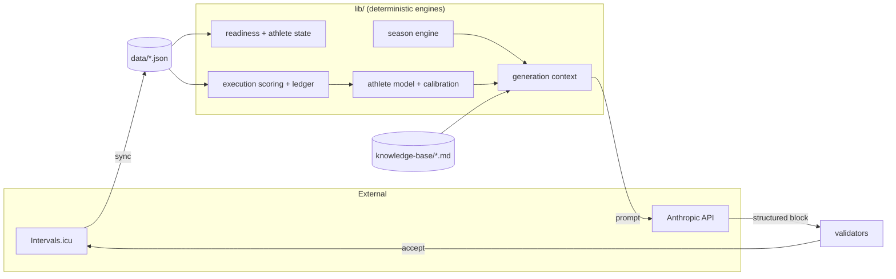

# Repository Atlas

The canonical map. If you read one doc, read this one. Details live in [systems/](START_HERE.md#the-systems-shelf) and [reference/](reference/FILE_INDEX.md); this page is for orientation.

## The one-paragraph mental model

NodeVelo is a single-athlete coaching brain. **Intervals.icu is the source of ride/wellness truth** (synced into `data/last-sync.json`); **NodeVelo owns intent and judgment** (plans, scores, calibration, knowledge). Deterministic TypeScript in `lib/` computes every number — readiness, execution scores, nutrition targets, week hours. Claude is called at exactly six places (see [reference/PROMPT_INDEX.md](reference/PROMPT_INDEX.md)) and is only allowed to *arrange and phrase*: it writes the day-by-day workout text for a block and the coaching prose, inside hard numeric constraints the engines computed first. Everything persists as JSON files in `data/` (gitignored, atomic writes + `.bak` recovery) and markdown in `knowledge-base/` (gitignored, athlete-editable).

## The three loops

Everything in the app serves one of three loops:

1. **Generation loop** (weeks): season focus → block skeleton → LLM writes the block → validators → athlete accepts → calendar events pushed to Intervals.icu. → [systems/generation-pipeline.md](systems/generation-pipeline.md)
2. **Daily loop** (hours): morning check → readiness/athlete-state → today's prescription guidance → ride → sync → analysis + coach note. → [systems/daily-loop.md](systems/daily-loop.md)
3. **Learning loop** (rides → months): every ride scored 1–10 → immutable ledger → athlete model + insights → interventions validated after 28 days → per-athlete calibration feeds back into the scorer and the next generation. → [systems/scoring-and-learning.md](systems/scoring-and-learning.md)

## Folder map

| Folder | Owns | Notes |
|---|---|---|
| `lib/` | All engine logic — 68 flat modules, tests colocated (`*.test.ts`) | The application's brain. See [lib/README.md](../lib/README.md) |
| `app/` | Next.js App Router: 7 pages + 21 API route groups | Pages are thin server shells; logic lives in `lib/`. See [app/README.md](../app/README.md) |
| `components/` | React UI (~40 files) | PascalCase = single component; lowercase = named-export module. See [components/README.md](../components/README.md) |
| `data/` | Runtime JSON state (gitignored) | Never edit by hand while the app runs; see [systems/data-and-sync.md](systems/data-and-sync.md) |
| `knowledge-base/` | Athlete's live coaching corpus (gitignored) | Edited via the Knowledge page or by hand |
| `knowledge-base-defaults/` | Committed KB skeleton/fallback | Real user-facing copy, kept minimal on purpose |
| `docs/` | This documentation system + `specs/` (design specs) + `superpowers/` (plans = immutable records, specs = stamped when shipped) | |
| `prototypes/` | Bounded spikes (currently `impeccable-audit/`) | Not imported by the app, not in the build |
| `public/` | Static assets | |
| `.claude/`, `.agents/` | Claude Code skills & config | `docs-sweep`, `hostile-review`, `handoff`, `whats-next`, `triage-audit` |
| `i-have-adhd/` | ⚠️ Untracked third-party git clone, never installed | Vestigial — pending an install-or-delete decision (open since 2026-07-02) |

## Entry points

- **Run**: `npm run dev` (127.0.0.1:3000) · `npm run dev:preview` (port 3100) · `npm run dev:lan` (0.0.0.0)
- **Verify**: `npm run check` = `tsc --noEmit && lint && vitest run`. Tests: `npm test`
- **Dev reset**: `npm run reset:today` → clears `data/today-analysis.json` (dev-only route) so the next sync recomputes today
- **Config**: `.env.local` — `INTERVALS_API_KEY`, `INTERVALS_ATHLETE_ID`, `ANTHROPIC_API_KEY` (required); `NODEVELO_BACKUP_DIR` (optional auto-snapshots); `NODEVELO_DATA_DIR` (tests point this at a throwaway dir)
- **Request entry**: `proxy.ts` at repo root (Next 16's renamed middleware) applies the CSRF same-origin guard to every `/api/*` request — the one cross-cutting policy no route can forget
- **App entry**: `app/layout.tsx` (fonts, dark-mode pre-hydration script, `QueryProvider > SyncProvider > Nav`); `app/page.tsx` redirects to `/today`

## The critical files (read these before touching anything nearby)

| File | Why it's critical |
|---|---|
| `lib/types.ts` (999 lines) | Every shared interface. 54 importers — the widest blast radius in the repo |
| `lib/json-store.ts` | Atomic write + `.bak` + per-file locking. ~25 hostile-review fixes (HR-31..59) hardened this; treat with care |
| `lib/data-store.ts` | Typed accessors over json-store; self-healing shape merges. 31 importers |
| `lib/execution-score.ts` | The 1–10 scorer every ride runs through |
| `lib/score-log.ts` | Builds the **append-only** ledger. Immutability invariants LEDGER-1/2 — see [reference/INVARIANTS.md](reference/INVARIANTS.md) |
| `lib/calibration.ts` | Per-athlete parameter derivation + the one precedence rule (manual override > derived > population default) |
| `lib/coach-snapshot.ts` | The single resolved-numbers bundle every LLM surface reads — prevents the AI inventing numbers |
| `lib/season.ts` (925 lines) | Largest engine: rolling + event-anchored season logic side by side |
| `app/api/sync/route.ts` (905 lines) | The sync orchestrator; touches nearly every store |
| `app/api/generate/route.ts` | Assembles the whole generation context; the deterministic→AI seam |
| `lib/anthropic-prompts.ts` | All prompt text (pure, unit-testable, no SDK imports) |

## What never to modify

- `data/*.json` by hand while judging behavior — state is interdependent; use the app or API routes.
- `docs/superpowers/plans/*.md` — immutable execution records, like commits.
- `CONTINUE.md` — written only by the `/handoff` skill.
- ROADMAP.md's cross-ref IDs (#1–4, §5–7, Track A–C) — other docs and skills link to them; append, never renumber.
- The ledger's frozen entries (`score-log.json` past dates) — see [reference/INVARIANTS.md](reference/INVARIANTS.md).
- `knowledge-base/` content without the athlete's intent — it's their coaching corpus, not fixture data.

## Generated / ignored artifacts

`.next/`, `tsconfig.tsbuildinfo` (build outputs) · `data/*.bak` (automatic single-depth backups of the CRITICAL store set) · `data/score-log.json.pre-rebuild-*.bak` (a **manual** snapshot taken before the one-shot ledger rebuild — no code writes this pattern) · `.superpowers/` (brainstorm scratch) · `.worktrees/` (excluded from vitest/eslint).

## Naming traps (30-second inoculation)

Full glossary: [GLOSSARY.md](GLOSSARY.md). The ones that bite:

- **`lib/trace.ts` is not LLM tracing** — it builds the ride power chart. There is *no* LLM trace module; debugging a generation uses `GeneratedPlan.raw` + offline prompt tests ([systems/ai-layer.md](systems/ai-layer.md)).
- **`lib/loading.ts` is carb-loading**, not training load. Training load lives in `readiness.ts` (ACWR, ramp).
- **`athlete-model.ts` vs `athlete-state.ts`**: model = who the athlete is historically (EWMA from the ledger); state = how they are *today* (0–100 fused score). State consumes model.
- **`durability.ts` vs `durability-score.ts`**: selection of the long-ride template vs grading its execution.
- **`system-prompt.test.ts` and `ask-coach.test.ts` have no matching modules** — they test functions living in `anthropic-prompts.ts` (re-exported via `anthropic-api.ts`).
- **`app/api/sync` imports `anthropic-api` but never calls the model** — it only checks `isAnthropicConfigured()`; the actual call is deferred to `/api/analyze`.
