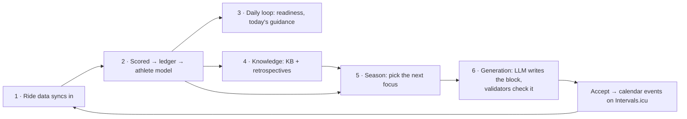

# Compass

**The one page you open when you don't know where to go.** Pin this tab. Everything else in the repo is reachable in one click from here. Don't read this top to bottom — find your row, click, leave.

## The mental model (60 seconds)

NodeVelo is one loop: rides come in, get judged, teach a model of the athlete, and that model shapes the next plan. Deterministic TypeScript computes every number; Claude only arranges sessions and phrases prose inside hard constraints. Intervals.icu owns physiology (one-way pull); the athlete owns intent; JSON files on disk are the database.

The numbers are the doc files: [systems/](systems/) is this pipeline in order — `01-sync-and-data` → `02-scoring-and-learning` → `03-daily-loop` → `04-knowledge` → `05-season` → `06-generation`, plus the two cross-cutting layers `07-ai-layer` (the Claude machinery step 6 uses) and `08-frontend` (the surface over everything).

## I need to…

| I need to… | Open | The files |
|---|---|---|
| understand the project from zero | [../README.md](../README.md), then the flow above | — |
| rebuild context after weeks away | This page top-to-bottom once (~5 min), then `git log --oneline -20` | — |
| find where anything lives / who imports it | [FILE_INDEX.md](FILE_INDEX.md), Ctrl+F | — |
| understand why a workout came out the way it did | [07-ai-layer § Debugging](systems/07-ai-layer.md#debugging-a-bad-generation) | `GeneratedPlan.raw`, `warnings[]`, `anthropic-prompts.test.ts` |
| debug generation | same as above | `app/api/generate/route.ts`, `lib/anthropic-prompts.ts` |
| change prompts / prompt rules | [RECIPES § generation](RECIPES.md#change-generation-behavior-prompt-rules-output-shape) | `lib/anthropic-prompts.ts` (+ bump `PROMPT_VERSION`) |
| change season logic | [05-season](systems/05-season.md) | `lib/season.ts`, `lib/season-signals.ts` |
| modify block generation | [06-generation](systems/06-generation.md) | `app/api/generate/route.ts`, `lib/block-skeleton.ts`, `lib/plan-schema.ts` |
| add a workout type | [RECIPES § workout type](RECIPES.md#add-a-workout-type) | `lib/types.ts`, `lib/workout-types.ts`, `lib/workout-validate.ts` |
| understand the athlete model / learning | [02-scoring-and-learning](systems/02-scoring-and-learning.md) | `lib/athlete-model.ts`, `lib/score-log.ts`, `lib/calibration.ts` |
| change scoring | [RECIPES § scoring](RECIPES.md#change-scoring) | `lib/execution-score.ts` (ledger stays frozen!) |
| add a readiness/state signal | [RECIPES § readiness](RECIPES.md#add-a-readinessstate-signal) | `lib/readiness.ts` → `athlete-state.ts` → `coach-snapshot.ts` |
| debug sync / data / a store file | [01-sync-and-data](systems/01-sync-and-data.md) | `app/api/sync/route.ts`, `lib/json-store.ts`, `npm run reset:today` |
| debug an API route | [FILE_INDEX § routes](FILE_INDEX.md#appapi--routes) for the route → its lib modules | `lib/log.ts` output, `lib/client-api.ts` on the client side |
| build or change UI | [08-frontend](systems/08-frontend.md) + [../DESIGN.md](../DESIGN.md) | `components/ui.tsx` primitives first |
| add a page / route / validator / test | [RECIPES.md](RECIPES.md) — find the recipe, follow it in order | — |
| decode a term or a weird file name | [GLOSSARY.md](GLOSSARY.md), Ctrl+F (naming traps live there too) | — |
| know what I must never break | [INVARIANTS.md](INVARIANTS.md) — scan the 30 numbered contracts | — |
| understand why it's built this way | [DECISIONS.md](DECISIONS.md) — 10 decision records, one file | — |
| know what the app can do (user-facing) | [../FEATURES.md](../FEATURES.md) | — |
| know what to work on next | [../ROADMAP.md](../ROADMAP.md) "State of the app" banner, then [../todo.md](../todo.md) | — |
| find something that already shipped | [../ARCHIVE.md](../ARCHIVE.md) — grep by ID (HR-nn, UXA-nn, P1–P7, SUB-n) | — |
| run / verify / commands | [../WORKFLOW.md](../WORKFLOW.md) cheat sheet | `npm run dev` · `npm run check` · `npm test` |

## Session rituals

**Opening (30 seconds):** `git log --oneline -5` → `git status --short` (uncommitted WIP? possibly the *other* concurrent session's — leave it) → back to work. Only re-read the mental model above if you're actually lost.

**Stuck >10 minutes?** That's the signal to open a doc, not grep harder: GLOSSARY (naming trap?) → FILE_INDEX (who else touches this?) → the numbered systems doc (the diagram shows the missing step) → DECISIONS (is the "weird" thing deliberate?).

**Closing — update the ONE doc that owns what you changed:**

| You changed… | Update |
|---|---|
| a user-visible capability | [../FEATURES.md](../FEATURES.md) |
| open/planned work | [../ROADMAP.md](../ROADMAP.md) (append IDs, never renumber) |
| something that shipped | move its line to [../ARCHIVE.md](../ARCHIVE.md) |
| a quick bug note | [../todo.md](../todo.md) |
| how a subsystem works | its `systems/0X-*.md` |
| a file/route/LLM call site | [FILE_INDEX.md](FILE_INDEX.md) (call sites: [07-ai-layer](systems/07-ai-layer.md#every-llm-call-site)) |

Never CONTINUE.md (that's `/handoff`'s), never `docs/superpowers/plans/` (immutable records).

## The repo at a glance

| Where | What |
|---|---|
| `lib/` | The brain — 68 flat engine modules, tests colocated. Everything numeric happens here |
| `app/` | 7 thin pages + 21 API routes (routes are IO shells over `lib/`) |
| `components/` | UI. PascalCase = one component; lowercase = named-export module |
| `data/` | The database: JSON files, gitignored, atomic writes + `.bak`. Don't hand-edit while judging behavior |
| `knowledge-base/` | The athlete's coaching corpus (gitignored; committed skeleton in `knowledge-base-defaults/`) |
| `docs/` | You are here. `systems/` = the pipeline; the rest is this page's one-click targets |
| `proxy.ts` (root) | Next 16's middleware — CSRF guard on all `/api/*` |
| `prototypes/`, `i-have-adhd/` | Bounded spike (fine); vestigial untracked clone (pending delete decision) |

**Critical files** (widest blast radius): `lib/types.ts` (999 lines, 54 importers) · `lib/json-store.ts` + `data-store.ts` (all persistence) · `lib/execution-score.ts` + `score-log.ts` (the frozen ledger) · `lib/season.ts` (925) · `app/api/sync/route.ts` (905) · `lib/anthropic-prompts.ts` (all prompt text) · `lib/coach-snapshot.ts` (the numbers every LLM surface reads).

**Red flags — scan [INVARIANTS.md](INVARIANTS.md) before touching:** the ledger (append-only, frozen) · migration flags (truthy, never `=== null`) · "today" (must be `lib/date.ts` local, never UTC) · prompts (protocol numbers exist in 3 hand-synced copies) · `types.ts` (everything moves when it moves) · anything under `data/`'s shape.

## For AI agents

This page + [INVARIANTS.md](INVARIANTS.md) is your orientation; [FILE_INDEX.md](FILE_INDEX.md) replaces exploratory file reads; [GLOSSARY.md](GLOSSARY.md) has the naming traps (`trace.ts` ≠ tracing, `loading.ts` ≠ training load, model ≠ state, `system-prompt.test.ts` has no matching module). Operating law — concurrency, commit policy, recurring bug classes — is [../AGENTS.md](../AGENTS.md)/[../CLAUDE.md](../CLAUDE.md), not this file. Stack warning: Next.js **16** — read `node_modules/next/dist/docs/` before trusting training-data conventions. Verify with `npm run check`; changed AI paths additionally need one live smoke run.

## The full doc set (one question each)

**Root:** README (what/why + setup) · FEATURES (what it does) · ROADMAP (what's next, stable IDs) · ARCHIVE (what shipped) · todo (live bugs) · DESIGN (visual tokens/rules) · UX-CONSTITUTION (UX decision law) · UX-MASTERPLAN (shipped UX redesign record) · WORKFLOW (daily commands/runbooks) · research (spikes, not commitments) · CONTINUE (session handoff, `/handoff` only) · AGENTS/CLAUDE (agent law).
**docs/:** COMPASS (this) · [systems/01–08](systems/) (the pipeline) · RECIPES (how to make changes) · FILE_INDEX (where everything is) · INVARIANTS (what never breaks) · DECISIONS (why it's built this way) · GLOSSARY (terms + traps) · specs/ (design specs) · superpowers/ (immutable plans + stamped specs).
