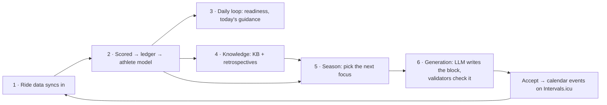

# Compass

**The one page you open when you don't know where to go.** Pin this tab. Everything else in the repo is reachable in one click from here. Don't read this top to bottom — find your row, click, leave.

## The mental model (60 seconds)

NodeVelo is one loop: rides come in, get judged, teach a model of the athlete, and that model shapes the next plan. Deterministic TypeScript computes every number; Claude only arranges sessions and phrases prose inside hard constraints. Intervals.icu owns physiology (one-way pull); the athlete owns intent; JSON files on disk are the database.

The numbers are the doc files: [systems/](systems/) is this pipeline in order — `01-sync-and-data` → `02-scoring-and-learning` → `03-daily-loop` → `04-knowledge` → `05-season` → `06-generation`, plus the three cross-cutting layers `07-ai-layer` (the Claude machinery step 6 uses), `08-frontend` (the surface over everything) and `09-nutrition` (what to eat, fed by the same sync and surfaced on the same pages).

## I need to…

| I need to… | Open | The files |
|---|---|---|
| **understand** the project from zero | [../README.md](../README.md), then the flow above | — |
| **rebuild** context after weeks away | Away >2 weeks: re-read the mental model + diagram above (~2 min), then `git log --oneline -20`. Shorter gaps: the Opening ritual below | — |
| **find** where anything lives / who imports it | [FILE_INDEX.md](FILE_INDEX.md), Ctrl+F | — |
| **debug / understand** a bad generated block | [07-ai-layer § Debugging](systems/07-ai-layer.md#debugging-a-bad-generation) | `GeneratedPlan.raw`, `warnings[]`, `app/api/generate/route.ts` |
| **change** prompts / prompt rules | [RECIPES § generation](RECIPES.md#change-generation-behavior-prompt-rules-output-shape) | `lib/anthropic-prompts.ts` (+ bump `PROMPT_VERSION`) |
| **change** season logic | [05-season](systems/05-season.md) | `lib/season.ts`, `lib/season-signals.ts` |
| **modify** block generation | [06-generation](systems/06-generation.md) | `app/api/generate/route.ts`, `lib/block-skeleton.ts`, `lib/plan-schema.ts` |
| **understand** why season picked this focus | [05-season § coverage selector](systems/05-season.md#the-coverage-selector) | `lib/season.ts`, `lib/season-signals.ts` |
| **add** a workout type | [RECIPES § workout type](RECIPES.md#add-a-workout-type) | `lib/types.ts`, `lib/workout-types.ts`, `lib/workout-validate.ts` |
| **understand** the athlete model / learning | [02-scoring-and-learning](systems/02-scoring-and-learning.md) | `lib/athlete-model.ts`, `lib/score-log.ts`, `lib/calibration.ts` |
| **change** scoring | [RECIPES § scoring](RECIPES.md#change-scoring) | `lib/execution-score.ts` (ledger stays frozen!) |
| **add** a readiness/state signal | [RECIPES § readiness](RECIPES.md#add-a-readinessstate-signal) | `lib/readiness.ts` → `athlete-state.ts` → `coach-snapshot.ts` |
| **debug** sync / data / a store file | [01-sync-and-data](systems/01-sync-and-data.md) | `app/api/sync/route.ts`, `lib/json-store.ts`, `npm run reset:today` |
| **debug** an API route | [FILE_INDEX § routes](FILE_INDEX.md#appapi--routes) for the route → its lib modules | `lib/log.ts` output, `lib/client-api.ts` on the client side |
| **build** or change UI | [08-frontend](systems/08-frontend.md) + [../DESIGN.md](../DESIGN.md) | `components/ui.tsx` primitives first |
| **add** a page | [RECIPES § page](RECIPES.md#add-a-page) | `app/`, `components/`, `Nav.tsx` |
| **add** an API route | [RECIPES § API route](RECIPES.md#add-an-api-route) | `app/api/`, logic in `lib/` |
| **add** a validator | [RECIPES § validator](RECIPES.md#add-or-change-a-validator) | `schedule-validate.ts` / `workout-validate.ts` |
| **change** what the athlete should eat | [09-nutrition](systems/09-nutrition.md) | `lib/nutrition.ts`, `lib/nutrition-validate.ts` |
| **understand** why today's target is that number | [09-nutrition § the formula](systems/09-nutrition.md#the-formula) | `lib/nutrition.ts` — `calculateDailyTarget`, `resolveBuffer` |
| **debug** a wrong NEAT multiplier / calibration | [09-nutrition § calibration](systems/09-nutrition.md#calibration--deriving-k-from-the-athletes-own-data) | `lib/nutrition.ts` — `calibrateNeat`; adopted in `app/api/sync/route.ts` |
| **add** a calibratable parameter | [RECIPES § calibration](RECIPES.md#add-a-calibratable-parameter) | `lib/calibration.ts`, `lib/correlation.ts` |
| **change** physiology / zones | [RECIPES § physiology](RECIPES.md#change-physiology--zones) | `lib/physiology.ts`, `lib/zones.ts` |
| **add** tests | [RECIPES § tests](RECIPES.md#add-tests) | colocated `*.test.ts` |
| **turn over** a block (end → retro → next) | [RECIPES § block turnover](RECIPES.md#turn-over-a-block-end--retrospective--next-block) | — |
| **decode** a term or a weird file name | [GLOSSARY.md](GLOSSARY.md), Ctrl+F (naming traps live there too) | — |
| **know** what I must never break | [INVARIANTS.md](INVARIANTS.md) — scan the numbered contracts | — |
| **understand** why it's built this way | [DECISIONS.md](DECISIONS.md) — all decision records, one file | — |
| **know** what the app can do (user-facing) | [../FEATURES.md](../FEATURES.md) | — |
| **know** what to work on next | [../ROADMAP.md](../ROADMAP.md) active order, then [../todo.md](../todo.md); phase boundary: [accepted investment review](reviews/2026-08-20-nodevelo-adversarial-investment-review.md) | — |
| **find** something that already shipped | [../ARCHIVE.md](../ARCHIVE.md) — grep by ID (HR-nn, UXA-nn, P1–P7, SUB-n) | — |
| **run** / verify / commands | [../WORKFLOW.md](../WORKFLOW.md) cheat sheet | `npm run dev` · `npm run check` · `npm test` |
| **work with Claude + Codex** | [../WORKFLOW.md § Hybrid workflow](../WORKFLOW.md#hybrid-claude--codex-workflow) | isolated worktrees · `npm run finish:agent-task` · GitHub auto-merge |

## Session rituals

**Opening (30 seconds):** `npm run sync` (fetch + fast-forward `main` + prune stale worktrees) →
`git branch --show-current` → `git log --oneline -5` → `git status --short`. Implementation must be
on a fresh `claude/<task>` or `codex/<task>` worktree, created via `npm run start:agent-task -- <agent>
<task-name>`; if you are on `main`, read only and start an isolated task. Only re-read the mental
model above if you're actually lost.

**Stuck >10 minutes?** That's the signal to open a doc, not grep harder: GLOSSARY (naming trap?) → FILE_INDEX (who else touches this?) → the numbered systems doc (the diagram shows the missing step) → DECISIONS (is the "weird" thing deliberate?). Six systems docs carry a **"Known rough edges"** section with live judgment calls, tripwires, and rejected alternatives for that area — `01-sync-and-data`, `05-season` (the deepest one — read before touching `season.ts`), `06-generation` (the week skeleton's staged decisions), `07-ai-layer`, `08-frontend`, `09-nutrition` (measured sensitivities and known biases, with their magnitudes). High-traffic files in those areas also carry an inline `// AI:` comment pointing at the relevant anchor.

**Closing — update the ONE doc that owns what you changed:**

| You changed… | Update |
|---|---|
| a user-visible capability | [../FEATURES.md](../FEATURES.md) |
| open/planned work | [../ROADMAP.md](../ROADMAP.md) (append IDs, never renumber) |
| something that shipped | move its line to [../ARCHIVE.md](../ARCHIVE.md) |
| a quick bug note | [../todo.md](../todo.md) |
| a plan you only partially executed | [../ROADMAP.md](../ROADMAP.md) — state exactly which tasks shipped vs remain; never leave the plan doc in `docs/superpowers/plans/` as the only record (a 1-of-10-tasks shipment went untracked and unwired this way once — 2026-08-04) |
| how a subsystem works | its `systems/0X-*.md` |
| a file/route/LLM call site | [FILE_INDEX.md](FILE_INDEX.md) (call sites: [07-ai-layer](systems/07-ai-layer.md#every-llm-call-site)) |

Never CONTINUE.md (that's `/handoff`'s), never `docs/superpowers/plans/` (immutable records).

## Critical files & red flags

Repo layout: the seven-line table in [../README.md](../README.md). Folder rules: each folder's own README.

**Widest blast radius** (sizes/importers: [FILE_INDEX.md](FILE_INDEX.md)): `lib/types.ts` · `lib/json-store.ts` + `data-store.ts` · `lib/execution-score.ts` + `score-log.ts` (the frozen ledger) · `lib/season.ts` · `app/api/sync/route.ts` · `lib/anthropic-prompts.ts` · `lib/coach-snapshot.ts`.

**Scan [INVARIANTS.md](INVARIANTS.md) before touching:** the ledger · migration flags · "today" dates · prompts (three-copy rule) · `types.ts` · `data/` shapes.

## For AI agents

Orientation = this page + [INVARIANTS.md](INVARIANTS.md). Lookups: [FILE_INDEX.md](FILE_INDEX.md) (files), [RECIPES.md](RECIPES.md) (change procedures), [GLOSSARY.md § naming traps](GLOSSARY.md#naming-traps) (e.g. `trace.ts` ≠ LLM tracing). Operating law — concurrency, commit policy, recurring bug classes — is [../AGENTS.md](../AGENTS.md)/[../CLAUDE.md](../CLAUDE.md). Stack is Next.js **16** (check `node_modules/next/dist/docs/`); verify with `npm run check`; a changed AI path needs one live smoke run ([how](systems/07-ai-layer.md#debugging-a-bad-generation)).

## The full doc set (one question each)

**Root:** README (what/why + setup) · FEATURES (what it does) · ROADMAP (what's next, stable IDs) · ARCHIVE (what shipped) · todo (live bugs) · DESIGN (visual tokens/rules) · UX-CONSTITUTION (UX decision law) · UX-MASTERPLAN (shipped UX redesign record) · WORKFLOW (daily commands/runbooks) · research (spikes, not commitments) · CONTINUE (session handoff, `/handoff` only) · AGENTS/CLAUDE (agent law).
**docs/:** COMPASS (this) · [systems/01–09](systems/) (the pipeline) · RECIPES (how to make changes) · FILE_INDEX (where everything is) · INVARIANTS (what never breaks) · DECISIONS (why it's built this way) · GLOSSARY (terms + traps) · specs/ (design specs) · [reviews/](reviews/) (point-in-time audits and decision records) · superpowers/ (immutable plans + stamped specs) · folder READMEs (`lib/`, `app/`, `components/`, `knowledge-base-defaults/`) — local rules, read alongside FILE_INDEX.
