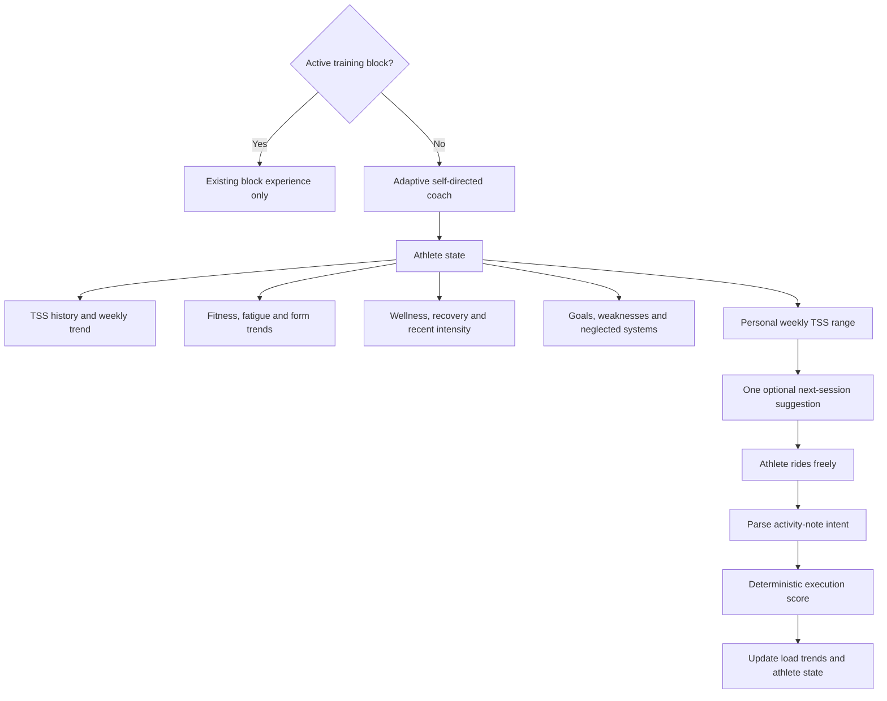

# Adaptive self-directed coach — Design scope

**Status:** Partially shipped through Phase 2c (2026-08-12): Phase 1 aerobic eligibility (PR #28),
Phase 2a origin/overlay envelope (PR #29), Phase 2b intent parsing/scoring (PR #35), and Phase 2c
overlay-aware debrief (PR #40). Phases 3 (TSS envelope + session suggestion) and 4 (historical repair)
remain unimplemented. **The locked product decisions in §2 are unchanged.**

**Date:** 2026-08-06

**Review handoff:** This document is the product/design basis for Claude to review and turn into an
implementation plan. It authorizes no implementation by itself.

## 1. Purpose

When no training block is active, the athlete still plans a route and session purpose before riding,
then records that same objective intent in the Intervals.icu activity description. The app currently
treats those rides as generic off-plan work. It infers a workout type from whole-ride intensity and
scores intrinsic characteristics rather than asking whether the athlete performed the ride they meant
to perform.

That produces misleading results. Two recent mixed-terrain rides both received `2/10 Poor` despite
their notes describing intentional Z2, climbing and scouting work. One debrief also treated a
whole-ride `15.7%` Pw:HR drift as an aerobic durability failure even though the ride finished with hard
climbing. That percentage cannot answer the steady-effort decoupling question for a structurally mixed
ride.

The feature defined here makes no-block training a first-class mode:

- understand the athlete's natural-language intent without requiring pre-ride UI;
- score the completed ride deterministically against that intent;
- use historical and current TSS as a personalized weekly load envelope;
- use load, recovery, goals and training balance to suggest one optional next session;
- repair the three-week no-block historical period through a careful one-time hybrid review; and
- keep the entire self-directed planning surface out of view whenever a block is active.

This is an adaptive self-directed coach, not a TSS quota tracker and not a second annual-plan system.

## 2. Locked product decisions

These decisions were approved during design review and must not be reopened by the implementation
plan unless a verified technical constraint makes one impossible.

1. **No pre-ride friction.** The athlete does not click a planning button, confirm a workout, or create
   a calendar entry. They ride and write the objective intent in the activity description as they do
   now.
2. **The note is the execution target.** In no-block mode, the post-ride activity description is parsed
   into structured intent and the ride is judged against it.
3. **The morning suggestion is advisory only.** Ignoring it cannot reduce execution, adherence or
   athlete-state scores.
4. **TSS sets dose, not workout type.** Recovery, recent intensity, goals, weaknesses and neglected
   systems choose the useful stimulus; TSS constrains how much.
5. **Weekly TSS is a range, not an exact quota.** It is personalized from trustworthy historical load,
   recalculated on Monday in the athlete's local timezone and frozen for the week. It may move down
   midweek for real recovery concerns, never up merely to normalize excess load.
6. **An active block is authoritative.** With a block present, the existing block experience is the only
   planning surface. The self-directed state, TSS range and suggested session are not displayed.
7. **Confidence is automatic and quiet.** High-confidence intent is accepted automatically; medium
   confidence scores only supported objectives; low confidence withholds the execution score. No new
   review buttons are added to the normal ride flow.
8. **Unclear intent never becomes a poor score.** Missing or ambiguous intent produces `Not scored`, not
   an arbitrary low number.
9. **Decoupling is segment-aware or absent.** A mixed ride cannot display whole-ride drift as evidence of
   aerobic failure. Only a qualifying steady aerobic segment may receive a drift value.
10. **Historical correction is hybrid and auditable.** Every ride in the three-week no-block period is
    manually reviewed from an AI-prepared report. Original ledger records remain intact; approved
    correction overlays become authoritative for derived coaching state.
11. **Actual training load is never rewritten by interpretation.** TSS/CTL/ATL/TSB continue to reflect
    the physical work recorded by Intervals.icu. Historical review changes the meaning and execution
    quality of rides, not their load.
12. **No duplicate Intervals graph.** The app distils the load state needed for a decision; it does not
    recreate Intervals.icu's configurable Fitness page.

## 3. Existing behaviour and the root problem

The current deterministic scoring core already provides a strong base:

- `lib/execution-score.ts` starts from a baseline of 5 and grades duration/adherence, intensity,
  aerobic reads, variability and RPE.
- `lib/score-log.ts` gives a planned ride its prescription, but an off-plan ride gets an inferred type
  from whole-ride IF and is scored with `intrinsic: true`.
- Off-plan scoring deliberately skips intensity-versus-type because scoring against a type inferred
  from the same intensity would be circular. It instead leans on Z2-only Pw:HR versus baseline,
  variability and RPE.
- `lib/athlete-state.ts` and `lib/athlete-model.ts` consume the ledger and currently treat off-plan
  frequency as plan drift.
- Intervals.icu `trainingLoad` already feeds readiness, weekly load, CTL/ATL/TSB and season logic.
- The score ledger is already append-oriented and freezes past context for reproducibility.

The missing concept is **self-directed intent**. “No block existed” is not the same fact as “the athlete
ignored a plan.” The implementation must distinguish at least these semantic origins:

- **Prescribed:** a formal block/session existed and remains the scoring target.
- **Self-directed:** no block existed and a sufficiently clear athlete intent was recovered.
- **Unspecified:** no block existed but there is not enough objective intent to score execution.

A self-directed ride must not count toward a “training is drifting off-plan” signal. Physical load still
counts for all three origins.

## 4. System boundary and data flow

The block/no-block gate is the first decision. The self-directed coach must not create a parallel
recommendation beneath an active block. Load tracking may continue internally because it is required
for readiness and later decisions, but its self-directed target UI stays hidden.

## 5. Intent interpretation contract

### 5.1 Source and timing

The source is the existing Intervals.icu activity description/note. No new pre-ride storage is
required. The app interprets the note after the activity is synced.

For a self-directed ride, the interpreter extracts only what the athlete stated:

- primary purpose;
- ordered phases of the ride;
- duration, zone, power, repetition or terrain targets when explicit;
- secondary objectives;
- whether each objective is measurable from available activity data; and
- confidence in the interpretation.

The raw note is retained verbatim. The interpretation must carry enough provenance to reproduce and
audit it: activity identity/date, note fingerprint, interpreter/schema version, creation time and
confidence. A later note edit creates a new interpretation version; it must not silently mutate the
historical explanation.

### 5.2 AI and deterministic responsibilities

The model may translate natural language into a constrained structured intent. It may not calculate
the execution score, TSS range, compliance, power accuracy or decoupling result. Those remain
deterministic TypeScript calculations, consistent with `docs/DECISIONS.md`.

The structured output must reject invented specificity. For example, “some Z4 and Z5 efforts” does not
become `4 × 5 min`, and “technical descent practice” does not become a claim that cornering quality was
good.

### 5.3 Confidence behaviour

- **High confidence:** automatically accept the interpretation and score every supported objective.
- **Medium confidence:** retain the interpretation, score only objectives directly supported by the
  note and data, and identify the limited basis in the debrief.
- **Low confidence:** retain the note and interpretation attempt but show `Not scored — intent could
  not be determined reliably`.
- **Missing intent:** show `Not scored — no intent found`.

“Review” in the normal flow means transparent wording, not a mandatory dialog. If the athlete later
clarifies the note, the existing re-analysis action is the only required retry path.

### 5.4 Active-block precedence

If a block prescribed a session for that date, the prescription remains the scoring target. A ride
note may add context using existing mechanisms, but it cannot redefine the formal session after the
fact to improve its execution score. Self-directed intent applies only when no block/session was
authoritative for the ride.

## 6. Self-directed execution scoring

Once intent is structured, the existing deterministic scoring engine should be extended or adapted,
not replaced by a second unrelated scoring framework. The implementation plan must first identify the
smallest shared scoring seam that can represent a prescribed target and a self-directed target without
duplicating core rules.

Only measurable, stated objectives may affect the score:

- completion and intended duration/dose;
- time or work completed in intended zones;
- explicit interval duration and power accuracy;
- ordered ride structure when the order is part of the intent;
- steadiness only inside a phase explicitly intended to be steady; and
- RPE as context when present.

The scorer must not penalize:

- variability during intentionally variable climbing or scouting;
- whole-ride IF merely because no block existed;
- deviation from the optional morning suggestion;
- qualitative skill objectives that sensors cannot validate;
- absence of a formal block; or
- missing metrics as though they were failed metrics.

Technical descending may be acknowledged as attempted. Speed, braking or GPS traces cannot safely
establish that cornering technique was good, so the skill-quality objective remains unscored unless a
future trustworthy measurement is explicitly designed.

The existing 1–10 score scale remains. A score requires enough objective evidence to be meaningful;
otherwise the result is `Not scored`. The UI should expose the intent used and a short evidence trail so
the athlete can understand the number without reverse-engineering the algorithm.

## 7. Aerobic decoupling and steady-segment eligibility

Whole-ride Pw:HR decoupling is meaningful only when power demand is sufficiently uniform. A ride that
mixes Z2 cruising, repeated hard climbs and a hard finishing effort does not meet that condition even
if its duration and average IF fall inside a broad endurance gate.

The new contract is:

1. Use a whole-ride decoupling value only when the whole ride qualifies as steady.
2. Otherwise search the activity time series for an explicitly intended or objectively qualifying
   steady aerobic segment.
3. A provisional segment must contain at least 30 continuous minutes, predominantly aerobic power,
   low variability, limited coasting, reliable HR/power and no hard intervals inside the window.
4. Compare like-for-like halves of that segment, not the first and second halves of the mixed ride.
5. If no segment qualifies, display `Aerobic drift not measurable — no sufficiently steady aerobic
   segment` and do not feed the whole-ride number to the coach narrative.

The 30-minute value is a minimum-data product threshold, not a universal physiological law. The
implementation plan should confirm what the synced stream resolution can support and make the exact
eligibility rules explicit and testable. It must preserve the locked behaviour: a hard climb outside
the steady segment cannot contaminate that segment's result.

Segment decoupling remains a durability/context observation rather than a direct generic execution
penalty. A displayed result must name its scope, for example:

> Aerobic drift 3.8% — opening 45-minute Z2 segment

## 8. Personalized weekly TSS envelope

### 8.1 Inputs

Use Intervals.icu's synced activity `trainingLoad` as the canonical completed-ride load whenever it is
available. The range uses:

- the latest 6–8 complete, trustworthy calendar weeks;
- current-week TSS;
- CTL/Fitness and its direction;
- ATL/Fatigue and its direction;
- TSB/Form as context;
- wellness/readiness and recent execution;
- recent intensity distribution and hard-session spacing; and
- recovery/disruption annotations already available to the app.

Incomplete current weeks, missing-data weeks, illness/travel disruptions and intentional recovery
weeks must be classified rather than blindly averaged into the normal-load anchor.

### 8.2 Anchor and week role

The robust anchor is the median load of recent comparable, tolerated training weeks. “Tolerated” means
the week was followed by acceptable recovery/wellness and no clear execution collapse; it does not mean
the athlete merely survived a high number.

The coming week is assigned one load role:

- **Build:** modestly above the tolerated anchor when recovery and recent response support progression.
- **Maintain:** around the anchor when the useful decision is consolidation.
- **Recovery:** materially below the anchor when fatigue, disruption or training rhythm calls for an
  unloading week.

The target is a range wide enough to absorb real outdoor variability. The approved starting design is
roughly ±7–8% around the role-adjusted centre; exact rounding should reflect realistic ride-sized TSS
increments rather than false precision. There is no universal “add 10%” rule and no claim that a fixed
percentage predicts injury.

The implementation plan must make the v1 role thresholds and range calculation deterministic and
versioned. It may reuse the app's existing personalized calibration/state conventions, but it must not
introduce a new medical or injury-risk claim.

### 8.3 Weekly lifecycle

- Resolve the week on Monday using `localToday()`/`resolveToday()`, never a UTC-derived “today.”
- Persist the resolved range, week role and calculation provenance so it does not drift on every sync.
- Freeze the normal range through Sunday.
- Permit a one-way midweek reduction if new fatigue/wellness evidence makes the original dose
  inappropriate.
- Never raise the target midweek simply because actual load has exceeded it.
- Finishing below, inside or above the range is context, not pass/fail compliance.

The most recent eight complete weeks observed during design averaged approximately `671 TSS` with a
median of `685`. After the one-time review excludes or classifies disrupted/recovery weeks correctly,
an illustrative ordinary-training range could be about `620–720 TSS`. That example must not be
hard-coded.

### 8.4 Expected session TSS

The suggested session's expected TSS is a range derived from intended duration and intensity (the
standard power-based estimate is approximately `hours × IF² × 100`). Outdoor terrain makes a single
exact prediction dishonest. Completed activity load is replaced by the canonical Intervals value once
the ride syncs.

## 9. Selecting the next suggested session

TSS answers “how much load is appropriate?” It does not answer “what should the athlete train?” The
selection priority is:

1. recovery/readiness guardrails;
2. hard-session spacing and recent intensity exposure;
3. current goals and known weaknesses;
4. training systems neglected by recent actual work; then
5. a duration/intensity dose that fits the weekly envelope.

The output is one concrete optional session, not a menu or a newly created plan. It includes:

- purpose;
- simple structure;
- duration range;
- expected TSS range; and
- one short evidence-based reason.

Example:

> **Suggested: aerobic endurance with controlled climbing**
>
> 90–120 minutes · mostly Z2 · optional short tempo climbing
>
> Expected load: 85–115 TSS
>
> Why: weekly load is progressing normally, but recent high-intensity exposure means another threshold
> session adds little value today.

Behaviour around the envelope is deliberately non-coercive:

- below range: never prescribe a desperate catch-up ride;
- inside range: choose the most useful stimulus, not the largest remaining TSS;
- above range: prefer recovery/low load without calling the week a failure; and
- ignored suggestion: record no adherence or execution penalty.

## 10. No-block athlete-state read

The current single athlete-state result can become inaccurate when self-directed rides are recorded as
poor off-plan execution. The no-block surface should instead summarize three separate evidence streams:

- **Load:** building, maintaining or unloading.
- **Recovery:** fresh, balanced or fatigue accumulating.
- **Execution:** consistent, mixed or uncertain against actual self-directed intent.

Example:

> **Productive training · mild fatigue**
>
> Weekly load is within your normal build range. Self-directed rides have been executed consistently,
> but recent intensity supports an aerobic day next.

The summary must be backed by deterministic state inputs. CTL/ATL/TSB are useful trend sensors, not a
complete readiness verdict and not standalone workout selectors. Subjective wellness and actual
execution may disagree with the mathematical load model; the UI should explain the resulting decision
rather than hide the disagreement.

This compact state, weekly range and suggested session are all hidden when a block is active.

## 11. Historical three-week repair

### 11.1 Review preparation

After the new system is implemented, run a one-time process over the candidate no-block window: the
contiguous period after the previous block ended and before another block became active, expected to
be about three weeks. The report must show the exact inclusive dates for approval before changing any
effective state. For every ride, include:

- original note;
- proposed structured intent;
- measurable and non-measurable objectives;
- original score and explanation;
- proposed retrospective score and explanation;
- interpretation confidence; and
- ambiguities requiring human judgment.

Because the period is small and materially affects the athlete model, every ride receives human review,
including high-confidence rows. AI reduces repetitive extraction; it does not silently approve history.
The process should be a temporary maintenance/report workflow, not a permanent historical-review UI.

### 11.2 Retrospective scoring safeguards

Use:

- original activity streams and metrics;
- the activity's recorded `icuFtp` or physiology valid on that date;
- thresholds/zones applicable at ride time;
- only the original note's intent; and
- the same deterministic scorer and segment eligibility used for future rides.

Do not use later goals, later performance or present-day knowledge to infer what the athlete meant.

### 11.3 Correction overlay

The existing ledger remains an audit record. An approved correction is an overlay keyed by stable
activity identity/date and carries:

- the structured self-directed intent;
- effective execution score or `Not scored`;
- confidence and evidence;
- reviewer/approval timestamp;
- scoring/interpreter versions; and
- a reference to the superseded original result.

Derived consumers resolve the overlay first and fall back to the original entry. Corrections can be
superseded or disabled; original records are never deleted.

### 11.4 Rebuild effects

After approval, rebuild derived coaching state from the beginning of the reviewed period through the
present:

- execution EWMA/consistency;
- strengths, weaknesses and session-type evidence;
- completed/compromised outcomes;
- recent intensity exposure;
- behaviour/off-plan summaries; and
- recommendation inputs.

Do not rewrite actual TSS, Fitness/CTL, Fatigue/ATL or Form/TSB. Those already describe the work done.

## 12. UI contract

### 12.1 No-block Today

One compact section, using existing dashboard visual language:

> **Productive training · mild fatigue**
>
> **449 TSS** this week · normal range **620–720**
>
> **Suggested today:** aerobic endurance with controlled climbing
>
> 90–120 min · mostly Z2 · expected 85–115 TSS

No confirmation, completion, planning or calendar-write control is added.

### 12.2 Completed ride

Before the score explanation, show the interpreted target:

> **Intent used:** 45 min steady Z2 → variable climbing → 9 min around 292 W → descending practice

Then show:

- execution score or an explicit `Not scored` reason;
- concise evidence for measurable objectives;
- qualitative objectives that were acknowledged but not graded; and
- scoped aerobic drift or `Not measurable`.

The existing re-analysis control remains sufficient after a note edit. No additional everyday buttons
are in scope.

### 12.3 Active block

Render none of the no-block state, TSS-range or suggestion section. The normal prescribed-session and
planned-versus-actual debrief remain unchanged except for any shared correctness improvement to
segment-scoped decoupling.

## 13. Failure and degraded-data behaviour

- Missing note → debrief may render, execution is `Not scored — no intent found`.
- Low-confidence note → `Not scored — intent could not be determined reliably`.
- Medium-confidence note → grade only explicitly supported objectives and say that the basis is
  limited.
- Missing power/HR → use valid available load, but do not fabricate power execution or drift.
- No qualifying steady segment → aerobic drift is `Not measurable`.
- Incomplete Intervals sync → retain the last trustworthy resolved state and label current data as
  pending; do not generate a confident new recommendation from partial inputs.
- Interpreter failure → preserve the raw note, withhold judgment and leave the existing re-analysis
  retry path available.
- Unexpectedly high weekly load → recommend recovery when appropriate; do not move the envelope upward
  to make the excess appear normal.
- Missing sufficient weekly history → show low-confidence load context or no range rather than falling
  back to a universal TSS target.

## 14. Acceptance examples

### 14.1 Detailed mixed ride (2026-08-06 screenshot)

Observed summary: 118 minutes, average HR 147, IF 0.84, NP 241 W, average power 200 W, whole-ride
decoupling shown as 15.7%. The note states:

- 45 minutes steady Z2;
- undulating climbing with Z4, Z5 and Z6 efforts plus short descents;
- a finishing 9-minute effort around 292 W; and
- technical descending practice.

Required outcome:

- interpret the four phases with high confidence;
- evaluate the Z2, climbing and 9-minute objectives from their relevant data windows;
- acknowledge but do not objectively grade descending skill quality;
- do not penalize variability that belongs to the climbing purpose;
- do not describe the whole-ride 15.7% as aerobic fade; and
- show drift only for the opening steady segment if it independently qualifies.

The scope does not predetermine a replacement number; it requires an evidence-based score rather than
the current generic `2/10` pathway.

### 14.2 Broad scouting ride (2026-08-05 screenshot)

Observed summary: 119 minutes, average HR 148, IF 0.84, NP 241 W, average power 206 W. The note states
mixed terrain, some Z4/Z5 efforts, KOM scouting and Z2 on the flats.

Required outcome:

- interpret the ride as self-directed mixed/scouting work;
- use medium confidence because durations, ordering and priorities are less specific;
- grade only the Z2-on-flats and stated harder-effort evidence the data can support;
- do not invent interval targets; and
- do not assign a poor score merely because no block existed.

### 14.3 Cross-cutting cases

1. Ignoring the morning suggestion creates no execution penalty.
2. A block hides every self-directed planning element.
3. An unclear note produces `Not scored`, not `Poor`.
4. A ride with no power/HR still contributes valid imported TSS but cannot receive invented
   power/decoupling judgments.
5. Approved historical overlays replace originals in athlete-state calculations without overwriting
   the ledger.
6. A Monday range stays stable through the week unless it is reduced for recovery evidence.
7. TSS remaining cannot by itself trigger an intensity session.
8. A self-directed ride does not count as plan drift when no plan existed.

## 15. Explicit non-goals

- A duplicate Intervals.icu Fitness/PMC graph.
- A full annual, season or block-plan generator.
- Fixed ACWR or week-over-week percentage injury warnings.
- Route prediction or route selection.
- Automatic workout publishing to Intervals.icu, Garmin or other calendars/devices.
- A permanent historical-review interface.
- New pre-ride planning, confirmation or completion buttons.
- Objective scoring of technical descending/cornering from speed alone.
- Replacing an active block's prescription with a retrospective note.
- Treating weekly TSS-range completion as adherence.

## 16. Research basis and cautions

- [Intervals.icu Fitness, Fatigue & Form](https://www.intervals.icu/features/fitness-chart/) describes
  the classic PMC view: load feeds long-term Fitness/CTL, short-term Fatigue/ATL and Form/TSB. The useful
  product lesson is to use these as trends and projection inputs, not to copy the graph.
- [Intervals.icu Annual Plan Builder](https://forum.intervals.icu/t/annual-training-plan-builder/122085)
  demonstrates load/time targets, future projection, recovery weeks and plateaus. Its defaults are
  planning heuristics, not universal athlete-specific truth.
- [TrainingPeaks TSS documentation](https://help.trainingpeaks.com/hc/en-us/articles/204071744-TSS-Training-Stress-Score)
  defines TSS from intensity and duration and uses it as the input to CTL/ATL.
- [TrainerRoad's TSS guidance](https://www.trainerroad.com/blog/tss-what-it-is-what-its-good-for-and-why-it-can-be-misleading/)
  emphasizes that TSS is useful for long-term load trends but equal TSS does not mean equal workout
  demands and there is no universally good weekly number.
- A study of competitive road cyclists found several training-load measures, including TSS, related to
  fitness changes, while individualization improved the relationship:
  [Sanders et al., 2017](https://pubmed.ncbi.nlm.nih.gov/28095061/).
- Acute:chronic workload ratio prescriptions should not be presented as validated injury-prevention
  rules; methodological reviews find insufficient support for that use:
  [Impellizzeri et al., 2020](https://pubmed.ncbi.nlm.nih.gov/32502973/).

## 17. Implementation-planning constraints

Claude's implementation plan should trace and reuse the existing scoring, score-log, athlete-state,
readiness, Intervals sync, local-date and Today-dashboard seams before proposing new files. In
particular:

- preserve the deterministic-numbers/AI-prose boundary;
- preserve ledger reproducibility and existing historical-block safeguards;
- resolve the root semantic distinction between prescribed, self-directed and unspecified rides in
  shared consumers rather than patching only the two screenshot paths;
- reuse canonical Intervals `trainingLoad` and existing CTL/ATL/TSB inputs;
- use `localToday()`/`resolveToday()` for the Monday boundary;
- make parser/scoring/range versions and provenance explicit;
- include one live smoke run for any changed LLM-backed intent path, as required by `AGENTS.md`;
- keep the permanent production surface small; and
- plan the one-time historical review as a separate, reversible migration step after the future-ride
  path is verified.

The plan may choose exact type names, file boundaries and persistence filenames. It may not change the
locked user-visible behaviour above without returning to design review.
