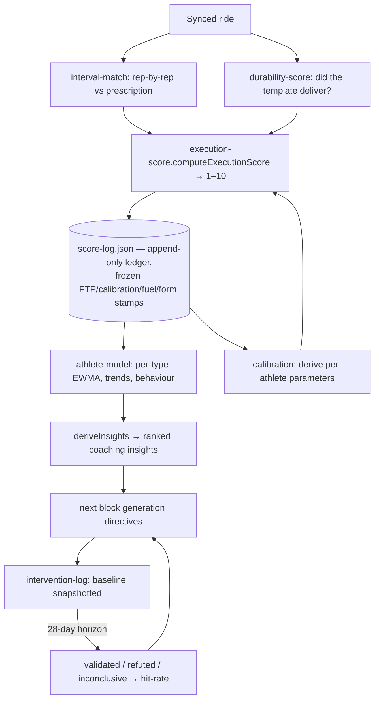

# 02 · Scoring & learning — how rides become a model of the athlete

**Why this exists:** a coach that doesn't measure whether its advice worked is a plan printer. This layer grades every ride deterministically, freezes the grades into an immutable ledger, learns a per-athlete model from it, and validates its own past advice — the "second brain." **Where it sits:** consumes [01-sync](01-sync-and-data.md)'s data; its model and calibration feed [05-season](05-season.md) and [06-generation](06-generation.md); its verdicts surface in [03-daily-loop](03-daily-loop.md) and Trends. **Tradeoff:** ledger immutability means schema changes need idempotent backfills, and old entries keep old logic's scores forever — honesty over tidiness.

## The scorer (`lib/execution-score.ts`, 368 lines)

`computeExecutionScore` grades **every** ride, planned or off-plan: interval adherence + duration compliance, intensity-vs-type IF bands (per-athlete offsets via calibration), the merged easy-ride HR+efficiency read, durability delivery (±2), off-plan aerobic quality, VI pacing, RPE-vs-intensity. Key exported distinction — three words that are not synonyms:

- **Execution score** — the 1–10 grade.
- **Compliance** — duration completed ÷ prescribed, *capped by execution* (`resolveCompliance`): a sub-5/10 session can never show 100% (the trust guarantee).
- **Adherence** — interval-day rep power vs target (`lib/interval-match.ts`, matched by duration, not power, to resist surge false-matches).

### Design details worth knowing (defensive by intent)

#### Adherence & compliance mechanics

- **Adherence reads average watts, not NP** — NP overstates short/variable efforts by 20%+; average power is what the athlete actually held. NP is still used to *filter* warm-up/recovery laps out of the work band.
- **Duration-aware completion** — a rep nailed on watts but cut short isn't a full rep; only reps holding ≥90% of prescribed duration count as completed.
- **Structural-mismatch guard** — when every rep ran ~half its prescribed length but power and rep count matched, that's a plan-definition-vs-detection mismatch (e.g. a SIT day stored as 1-min reps, ridden as 30s): the untrustworthy duration penalty is dropped, and the UI explains why. Extra efforts beyond the prescribed count surface as bonus context, never silently dropped.
- **Easy rides are judged on HR, not power.** Outdoor Z2 *power* is unholdable (descents, corners spike watts), so power-zone time and VI are reward-only on Z2/Recovery days. The judge is `mergedEasyRead`: the HR-zone read (time above the aerobic ceiling — terrain-immune) merged with the ride's Pw:HR efficiency vs the athlete's own 90-day baseline. Dialed HR earns +1 unless efficiency is hollow (0); drift is neutral unless efficiency corroborates it (−2); running hot is always −4 (the overtraining guardrail). Never applied off-plan or to durability templates B–E, where embedded efforts are the point.
- **Interval days are born interval-aware** — a bounded birth-time fetch at sync (≤6 dates, newest first, best-effort) picks up late-synced rides so a quality day isn't frozen with a coarse score forever; the adherence signal is frozen onto the entry (`RideScoreEntry.intervals`) so a rebuild can re-score without re-fetching.

#### PR & FTP handling

- **PRs are curve-vs-curve** (`lib/pr.ts`): the fresh power curve against the previous sync's curve, per standard duration — both sides Intervals.icu's own math, so no stream-vs-curve mismatch (which used to manufacture fake +1W PRs).
- **FTP anchoring**: each ledger entry prefers the ride's own `icu_ftp` (Intervals.icu's per-activity record — exact even when an FTP change synced late), falling back to `physiologyAsOf(rideDate)`. Zones store as **% of FTP** so one FTP change updates every zone coherently — scalar/zone drift is structurally impossible.

#### Long-term markers & model numbers

- **FTP-independent markers are the long-term backbone** (they survive FTP redefinition): Pw:HR/EF — deliberately like-for-like: **outdoor** rides only (indoor ERG flattens power:HR), steady endurance band, ≥45 min, VI within `AEROBIC_MAX_VI` (fail-closed when uncomputable); and the fueling/weight graph aggregates **complete weeks only** (an in-progress week's totals are misleadingly low).
- **The model's numbers**: EWMA α = 0.35 (adaptive via calibration), trend = split-half mean comparison with an epsilon band, minimum 3 observations before any pattern fires.

## The ledger (`lib/score-log.ts`, 411 lines)

`buildRideScores` runs the scorer over the sync window and merges into `data/score-log.json` — **append-only**. Past entries are frozen with provenance stamps: FTP-used (`physiologyAsOf`), calibration values, fuel, NP-fallback, form state. Only today's entry keeps re-deriving until the day rolls over. Capped at 400 entries (~6 months). Two named invariants (**LEDGER-1**: a rebuild can never un-plan a frozen entry; **LEDGER-2**: append-only merge) are enforced by `mergeScoreLog` / `mergeScoreLogRebuild` — see [../INVARIANTS.md](../INVARIANTS.md). A one-shot destructive rebuild exists (`/api/sync` POST with `rebuildLedger: true`), guarded by `data/ledger-rebuild.json` (truthy check, not `=== null` — the migration-flag rule).

Dispositions modulate teaching, not scores: a "compromised" ride keeps its raw score but is excluded from teaching the model (`lib/disposition.ts`).

## The model (`lib/athlete-model.ts`)

Rebuilt fresh from the whole ledger on demand: recency-weighted (EWMA, adaptive α from `calibration.autoEwmaAlpha`) per-type execution quality, trend, and behaviour summary → `deriveInsights` ranks coaching insights. Consumed by generation directives, season focus selection, Trends, and athlete state.

## The validation loop (`lib/intervention.ts`)

When an insight actually drives a generated block, `buildInterventions` snapshots a baseline (execution + physiology markers). After a 28-day maturation horizon, `validateInterventions` re-measures: validated / refuted / inconclusive. `summariseValidation` turns the record into a hit-rate that (a) surfaces on Model/Trends as the coach's honesty score and (b) **demotes** directives with a proven-poor hit-rate (≤34% over ≥3 decisive blocks) in `lib/synthesis.ts` — reframed as "try a different lever," evidence never hidden.

## Calibration (`lib/calibration.ts`, 533 lines)

Replaces population magic numbers with athlete-derived values *only when honestly derivable*. The single precedence rule (`trustedCalibration`): **manual override > derived (if discriminating) > population default**. Derived values must separate failures from successes by a margin (`lib/correlation.ts` — `deriveExecutionEdge` finds where things break, `deriveOptimum` where they work); a non-discriminating signal falls back to the default rather than calibrating to habit. Currently calibrated: ACWR bands, TSB deep-fatigue edge, decoupling-good cutoff, carbs optimum, per-type IF-band offsets, durability-insert envelope, athlete-state weights. Import direction is one-way: `calibration → correlation`, never the reverse (cycle avoidance).

## Where each piece runs

Scoring happens inside `POST /api/sync` (see [01-sync-and-data.md](01-sync-and-data.md)); the model/insights are computed on demand by `/api/trends`, `/api/generate`, `/api/write`; interventions are recorded at write time and validated at sync time.

## Known rough edges

- **Phases 2b–2c shipped 2026-08-12.** A self-directed ride can now replace the ledger's
  generic off-plan verdict in derived state with a deterministic score against objectives recovered
  from the athlete's own note; the Today debrief renders that effective outcome and refreshes after
  deferred parsing completes. Sandboxed real-data verification started at sample size 27, overall
  execution EWMA 6.7, all-time off-plan 50%, and recent drift quality 5.0; the three live-smoke
  overlays moved those reads to 29, 5.5, 46%, and 5.3. The August 5 and 6 acceptance rides resolved as
  medium-confidence RaceSim outcomes scored 5 and 4. The model did invent/assume two ungrounded
  details (full-ride duration and bare `292` as watts/power); deterministic grounding excluded both.
- **Two drift-signal defects found in PR #35's review, fixed 2026-08-12 (Phase 2c Tasks 8–9).**
  `summariseBehaviour`'s `driftAvgQuality` was excluding any drift ride whose overlay carried a
  `notScoredReason` (empty/unreliable note → `effectiveExecutionScore: null`) instead of falling back to
  the ledger's own deterministic score — left unfixed, the average would have degraded toward permanently
  `null` as more drift rides acquired an overlay. And a note from which the model extracted zero
  objectives was classified `no-measurable-objectives`/self-directed — the same reason genuinely
  ungradable-but-real objectives get — exempting it from `offPlanPct` even though no trustworthy training
  intent existed; it now maps to `intent-unreliable`/unspecified. Neither fix touches classification of a
  ride with a real, gradable note (e.g. two described effort blocks) — those already resolve
  `self-directed` and are excluded from drift by construction, unaffected by either fix.
- **`autoFromDate` gates rollout.** The historical no-block period from 2026-07-24 to the persisted
  boundary remains Phase 4's human-reviewed work and is never auto-written by 2b.
- **Per-type learning deliberately excludes self-directed rides.** Their current inferred type comes
  from whole-ride IF, so including it would revive circular type learning. Two independent unlock
  conditions remain: **the two score populations are not yet known to be comparable** (prescribed
  adherence/IF scores versus self-directed objective scores need a real corpus), and **compliance still
  has no meaning for these rides** (`comps.length ? … : 0` would falsely report 0%). See INVARIANT 40.
- **Phase 2a's review found the same defect shape four times, across two different authors — read this
  before adding a new place that reads `origin`, `status`, or `legacy`.** Two were caught in the plan
  before implementation: drift accounting read the raw ledger row's origin instead of the effective,
  overlay-resolved one — the ledger freezes at `unspecified` before any parse can ever run, so a
  self-directed ride would have inflated drift forever, the exact inversion of decision #1; and overlay
  selection picked the newest candidate BEFORE checking whether it was even applicable, so a `pending`
  record could silently suppress an already-approved one the moment it existed. Two more survived into
  the implementation of the corrected plan: `isCoherent` validated an overlay's internal consistency but
  never rejected `origin: "prescribed"` — a status only the ledger's own `planned` flag may legitimately
  establish — so a malformed overlay could claim it and revive per-type/compliance pollution; and the new
  `overallScored` admission filter dropped the `legacy` exclusion that used to hold for free under the OLD
  `planned === true` admission rule, once that rule widened to admit self-directed rides too (100 of 149
  rows on the real ledger are legacy — not a hypothetical population). All four share one shape: a
  validity check correct at the ONE point its author was reasoning about, silently absent at a DIFFERENT
  point that reads the same field through a different path. None were visible from "do the tests pass" —
  each needed the actual data lifecycle simulated by hand (a record's real sequence of states over time,
  or two admission points compared side by side) before it surfaced. When a later phase adds a new
  consumer of `origin`, `status`, `supersededBy`, or `legacy`, re-derive from scratch whether every
  existing guarantee still holds there — don't assume it does because it held somewhere else. All four are
  fixed on `main` as of PR #29; see `lib/intent-overlay.ts`'s `isCoherent`/`isApplicable` and
  `lib/athlete-model.ts`'s `overallScored` filter for the closed shape.
- **Off-plan rides without trustworthy measurable intent (and planned-but-surgy rides) still score
  flat.** Phase 1 (2026-08-06) removed
  the axes that were punishing structurally mixed rides for their own structure — the circular VI penalty,
  and the contaminated intrinsic/merged-read Pw:HR efficiency signal (fixed entirely at its producer,
  `qualifyingPwHr` in `lib/aerobic.ts` — no gate was added in `score-log.ts` or `ride-analysis.ts` for this
  signal). Both removals are correct, but they leave a mixed ride with almost no quality differentiator:
  expect scores clustering around baseline (5/10) for most of them. Phase 2b restores the differentiator
  only when the athlete's activity note provides grounded, measurable intent. Don't "fix" the residual
  flatness by re-adding a
  structure-derived penalty, and don't re-add a consumer-side comparability gate for `aerobicEffPct` — it's
  already correctly gated where it's computed.
- **The Pw:HR baseline and decoupling-good cutoff moved when Phase 1 shipped, and will keep moving.** The
  athlete's true steady-ride drift mean was measured well under `DECOUPLING_GOOD_BOUNDS.min` as of the
  2026-08-06 sync window, so `deriveDecouplingGood` clamps to its floor — that's the bounds doing their job
  on a pool that used to include structurally mixed rides, not a calibration failure. Both this value and
  the exact pool sizes are recalculated fresh on every sync from a rolling 90-day window; don't treat any
  specific number recorded in this plan's own text as durable.
- **`qualifyingPwHr` and `isSteadyEnduranceRide` are deliberately different gates.** See INVARIANT 34. A
  future change that needs "is this ride aerobically trustworthy" almost always means ONE of these two,
  not both — check which question is actually being asked before reaching for either.
- **`computeRollingBaselines`'s `avgDecoupling90d` remains the one ungated raw-decoupling consumer.**
  It is a broad recent-baseline display, not a ride-quality verdict; the block retrospective now gates
  its average through `isSteadyEnduranceRide`. Revisit the rolling baseline only if the card needs a
  whole-ride-comparable endurance meaning rather than its current broad descriptive one.
- **Non-today zone evidence uses Intervals.icu's own zone boundaries.** Those arrays are the only
  historical evidence available without extra network work. Boundary definitions can change a zone
  objective's grade; an absent array can make it unscoreable. Both are intended and explicit.
- **Segment decoupling is deliberately absent.** Unlock it only after (1) measuring the actual stream
  sample rate across at least 20 real activities, (2) characterising whether dropouts are absent or
  zero-filled samples, and (3) showing a 30-minute half-split reproduces after a refetch under those
  conditions. Until then, a mixed ride cannot manufacture an aerobic-drift verdict from an assumed
  timeline.
- **`carbsOptimum`'s calibration pool is thin, and this branch narrows it further.** It shares
  `steadyEndurance90d` with `decouplingGood` (see the bullet above on that pool shrinking), then filters
  further to rides ≥90 min with logged carbs and `|aerobicEffPct| ≥ 3%` — as of the 2026-08-06 sync
  window that leaves exactly 1 "good" and 3 "bad" observations. `deriveOptimum` (`lib/correlation.ts:108`)
  only falls back to the frozen prior when EITHER side hits zero, so it still re-derives today, but at
  "low" confidence (it already was, pre-Phase-1) and on a margin thin enough that losing the single good
  observation on a future sync (the rolling 90-day window ages it out with no replacement) would freeze
  the value in place with a refreshed timestamp — indistinguishable from a live one on the Model panel.
  Worth a periodic check, not an immediate fix.
- **A compound climb+descent lap remains a terrain-matching limitation after Phase 3c (2026-08-14).**
  The Phase 3c data gate inspected 25 live non-empty Intervals.icu interval payloads and found only
  `average_gradient` and `Maxgradient`, with no minimum/trough-gradient field. Without that source, the
  matcher cannot honestly distinguish a lap containing both terrains, and this phase did not invent a
  stream- or elevation-derived substitute. Gradient fallback can therefore still read such a lap's
  peak-positive pitch as a climb while dropping its descent. Curate one lap per climb and another per
  descent as the interim workaround; a future fix needs a newly verified data source and design review.
- **Zone-emphasis/zone-time claims are graded against the WHOLE ride's zone-time array, never a
  phase-scoped slice, even after NV-2 (2026-08-15) fixed zone-string parsing itself.** `zoneMinutes`
  (`lib/intent-scoring.ts`) has no notion of "the last 15 minutes" or "on the climbs" — it can only read
  `evidence.powerZoneTimes`/`hrZoneTimes` in full. Live-confirmed the same day NV-2 shipped: a
  15-minute "varied terrain (Z2/Z3)" cooldown phase, correctly parsed and grounded as `zone: "Z2-Z3"`,
  scored `65.2 min in Z2-Z3 vs 15 min stated (435% of target)` — the scorer summed the WHOLE ride's Z2+Z3
  time (most of a Z3-block ride) against a claim that only applied to its final segment. Not a
  regression from NV-2 — the same whole-ride read applied before, on the (rarer) unparseable range
  strings that failed grounding instead. Fixing this needs the zone-emphasis/zone-time path to route
  through the same terrain/phase-matched-lap machinery `effort`/`terrain` objectives already use, rather
  than reading the aggregate array directly — a real design change, not a parsing fix, and out of NV-2's
  scope. `complianceDelta`'s reward-only shape absorbs the overshoot without a nonsensical SCORE, but
  the evidence text itself still misleads about what was actually measured.
- **Phase 3b (2026-08-12) added HR-ceiling, cadence and terrain claims to self-directed intent-scoring.**
  `ExecutedInterval` gained `maxHr`/`avgCadenceRpm`/`maxGradientPct`/`elevationGainM`/`label`; `matchLaps`
  now ranks by whichever target field an objective stated (never a blend — `TargetSchema` enforces at
  most one of {power, HR, cadence, terrain} per objective; `zone`/`durationMin`/`reps` may still co-occur
  with any of them). Terrain matching is label-first (`ExecutedInterval.label`, athlete-typed free text —
  real per Intervals.icu's own labelling feature, but null on every real ride sampled during design; the
  athlete had not started labelling yet), gradient-fallback second — climb uses `maxGradientPct` (peak),
  descent uses `avgGradientPct` (signed average; a peak-gradient check is the wrong statistic for
  descents, found in this phase's own review). **An HR/cadence claim with no stated interval duration
  (the phase's own motivating note, "if HR goes over 154bpm dial back to stay in z2") grades against the
  WHOLE ride** (`RideEvidence.wholeRideMaxHr`/`wholeRideAvgCadence`, from already-synced
  `activity.maxHr`/`activity.avgCadence`) rather than staying ungraded — a duration-only, non-zone claim
  prefers the more precise matched-lap path instead. **Per-interval `decoupling` is available in the
  existing interval payload but is neither mapped into nor consumed through `ExecutedInterval`.** It
  remains a possible input to Phase 3a's deferred segment-scoped aerobic-drift work, not Phase 3b.
- **Phase 3c closed the terrain gradient-fallback overmatch (2026-08-14, `5c8b473`).** The live-smoke
  shape was an unlabelled 103-minute lap matching a stated 10-minute climb through a peak-gradient floor,
  which `complianceDelta` then rewarded as full compliance. `matchTerrain` in
  `lib/intent-scoring.ts` now rejects an unlabelled gradient-fallback candidate longer than
  `TERRAIN_OVERMATCH_RATIO` (3×) the stated duration, leaving the terrain objective ungraded instead.
  Label-matched laps remain exempt, and the no-stated-duration path is unchanged.

## Common modifications

| Change | Where | Watch out |
|---|---|---|
| Scoring signal weights/bands | `execution-score.ts` | Frozen ledger entries must NOT be retro-scored; new logic applies to new entries only |
| New calibratable parameter | `calibration.ts` (+ `correlation.ts` if a new derivation shape) | Route through `trustedCalibration`; keep the discrimination guard |
| New insight type | `athlete-model.deriveInsights` | It only earns prompt space via `synthesis.ts`'s ranking |
| Ledger schema field | `score-log.ts` + `sync-ledger.backfillLedgerEntries` | Backfill must be idempotent; migration flags use truthy checks |
| Test fixtures | — | Don't pin expectations whose pre-rounding value sits on a .x5 float boundary (known IEEE flip trap) |
