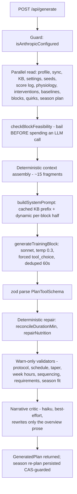

# 06 · Generation — how a training block comes to exist

**Why this exists:** this is where everything upstream converges — the model's insights, the season's focus, the knowledge base, the calibrated parameters — into one prompt, one forced-structure LLM call, and a validation gauntlet. The design bet: deterministic engines decide *what* the block must contain; the LLM only decides *arrangement and wording* ([DECISIONS](../DECISIONS.md) ADR-0002). **Where it sits:** the pipeline's last computational stage; its accepted output becomes calendar events ([01-sync](01-sync-and-data.md)'s mirror) and, once ridden, new input for [02-scoring](02-scoring-and-learning.md). **Tradeoff:** no self-repair loop for structural failures — a malformed response is a visible 502, never a silent patch.

The daily use loop is deliberately minimal — no manual markdown step survives: **sync → generate → review warnings → accept (write) → ride**. Companion docs: [07-ai-layer.md](07-ai-layer.md) (the Anthropic mechanics + all call sites), [05-season.md](05-season.md) (focus selection).

## The two-phase commit

Generation is a **proposal**; nothing becomes real until the athlete accepts.

- `POST /api/generate` — assembles context, calls Claude, validates, returns a `GeneratedPlan`. Persists **nothing** except (best-effort, CAS-guarded) an updated `season-plan.json`.
- `POST /api/write` — the accept step: pushes calendar events to Intervals.icu (idempotent upserts keyed `nodevelo-<date>`, with rollback on partial failure), archives the old block's lived days to `block-history.json`, records interventions, writes `current-block.json`.

A rejected or failed generation therefore never corrupts state or burns calendar writes ([ADR-0003](../DECISIONS.md)).

## Pipeline walkthrough (`app/api/generate/route.ts`, maxDuration 300s)

### 1. Deterministic pre-work (before any AI)

| Step | Module | Output |
|---|---|---|
| Focus selection | `season-signals.gatherFocusInputs` → `season.chooseNextFocus` (or event arc) | The block's `seasonFocus` + season context text |
| Week targets | `block-skeleton.computeWeekTargets` (+ `checkBlockFeasibility` pre-gate) | One **exact** hour figure per week (loading = top of range; recovery = derived retention %) |
| **Week skeleton** | `block-skeleton.computeBlockSkeleton` → `formatBlockSkeleton` | Seven typed day-slots per week — see below. This supersedes the bare hour figure in the prompt |
| Durability template | `durability.selectDurabilityTemplate` (limiter → goal text → rotation) | Template A–E for the long ride |
| Session requirements | `session-requirements.deriveSessionRequirements` | e.g. "≥1 RaceSim" from goal/terrain text |
| Coaching directives | `athlete-model.deriveInsights` + `intervention.summariseValidation` → `synthesis.synthesizeCoachingDirectives` | ONE ranked, deduped directives block; proven-poor directives (≤34% hit-rate over ≥3 decisive blocks) demoted, never hidden |
| Athlete facts | `coach-snapshot.resolveCoachSignals` / `formatFormFuelLine`, live zones from `physiology.ts`, power profile, quirks, deferred quality, goals/weakpoints (JSON, not the markdown) | Prompt fragments |
| Nutrition table | `nutrition.buildNutritionReferenceRows` | A table the model must **copy from**, never compute |
| Prior-block feedback | `kb-loader.latestRetrospectiveSeeds` + `retrospective-schema.formatReflectionsForPrompt` | The two feedback channels ([04-knowledge.md](04-knowledge.md)) |

#### The week skeleton (composition authority)

**Why it exists:** given one hour figure per week, the model had to solve the per-day split itself, and undershot every time — a live 4-week generation on 2026-07-29 produced loading weeks of 11.2 / 11.5 / 10.9h against a 12h target. `computeBlockSkeleton` (Phase B, [plan](../superpowers/plans/2026-07-29-block-generation-phase-b-skeleton.md)) does that arithmetic deterministically instead.

**What it decides** — seven `DaySlot`s per week, each with a `kind` (`quality` / `longRide` / `easy` / `rest` / `event`), an `allowedTypes` list, a duration envelope, an optional `%FTP` ceiling, and a one-line `reason` that is rendered into the prompt *and* quoted back by the validator, so instruction and failure message are one value.

**Two invariants it guarantees**, both swept over tens of thousands of settings combinations in `block-skeleton.test.ts`:
1. A week's `nominalMin` values sum **exactly** to `round(targetHours × 60)`.
2. Every slot satisfies `0 ≤ minMin ≤ nominalMin ≤ maxMin`.

**Things that are easy to get wrong here, all of which were:**
- Allocation is driven by the slots **actually placed**, never by the configured budget — the rest/quality placement priorities can collide, and driving arithmetic off the budget shorted the week by exactly the unplaced session.
- An **event** day carries the duration of whatever slot it displaced rather than zero, or its week can never reach target (a Saturday race collides with the canonical long-ride day).
- Only the **first** quality slot of a loading week is locked to the block's focus type. Locking all of them produced two identical session types in a week and made `session-requirements`' block-wide RaceSim floor unsatisfiable.
- Quality slot length is **per session type** (SIT 55, VO2max 75, Threshold 80, RaceSim 100), not a flat figure. A 5×30s SIT protocol is ~55 min and cannot fill a 75-min slot without artificial padding; a flat slot flagged correct sessions every week.
- The flexible second quality slot's envelope spans **every type it allows**, or a legitimate SIT and a legitimate RaceSim both fail the same slot.

**What the LLM still owns:** interval prescriptions, the exact duration inside each envelope, and all prose. Composition moved; content did not.

⚠️ **Duration is measured from the workout steps.** `reconcileDurationMin` overwrites the model's stated `durationMin` with the real step-sum, so a session only fills its slot if its *steps* add up — the prompt says this explicitly because the model otherwise wrote a correct-looking number above steps totalling less.

### 2. The AI seam

`lib/anthropic-prompts.buildSystemPrompt` splits the system prompt for prompt caching: **cached** = persona + workout-syntax guide + full KB text (stable prefix, `cache_control: ephemeral`); **dynamic** = every per-block fragment above (appended after the breakpoint so it never invalidates the cache). `buildUserMessage` carries the hard rules (interval protocols, RaceSim rules, weekly structure/sequencing) plus the calendar and nutrition table. The call is forced tool-use (`TRAINING_BLOCK_TOOL` from `lib/plan-schema.ts`) — no free-text parsing; the legacy regex parser in `plan-parser.ts` is retired (only its `planDayToEvent` calendar converter is live).

`PlanToolSchema` deliberately declares `weeks` **before** `overview` — tool-use fills fields in declared order, forcing the model to commit every day before summarizing (stops overview/schedule mismatch at the source).

### 3. After the model returns

- **Structural failure = hard throw** (502, manual retry). A truncation is distinguished from malformed output; there is deliberately no auto-repair loop for structure.
- **Deterministic repair (the only mutations)**: `reconcileDurationMin` (stated duration ↔ real step-sum) and `nutrition-validate.repairNutrition` (kcal figure rewritten to the formula's value, with a visible `repairs` note).
- **Warn-only validators** (append to `warnings[]`, never rewrite — [ADR-0004](../DECISIONS.md)): `workout-validate.splitPlanProtocol` (KB-grounded intensity/duration bands; quality-type breaches surface separately as `protocolViolations`), `schedule-validate` (back-to-back hard days, quality budget, event taper, freshness-first sequencing, `validateRecoveryWeekDensity`, `validateSkeletonConformance`), `block-skeleton.validateWeekHours`, `session-requirements.validateSessionRequirements`, season-fit/focus validators from `season.ts`.
- **One fact, one owner.** These validators overlap by subject and were deliberately de-duplicated: `validateSkeletonConformance` owns *per-day* facts (missing day, type outside its slot, duration outside its envelope); `validateWeekHours` owns the *weekly total*; `validateRecoveryWeekDensity` owns recovery-week composition. Before adding a warning, check no existing validator already states that fact — a recovery week once produced three near-identical warnings for one problem, and this codebase treats redundant warnings as a real defect ("false warnings cause data fatigue", `workout-validate.ts`).
- **Skeleton conformance is warn-only *by staged decision*, not oversight.** Hard-failing a locked-type mismatch was the original design; it is deferred until real runs show the model complies, because a skeleton too rigid on its first outing turns every generation into a 502. The escalation is a one-line change in `validateSkeletonConformance`.
- **Narrative critic** (`lib/narrative-critic.ts`, haiku, forced tool-use): checks the model's written overview against deterministically-extracted real facts of the schedule; may rewrite the **overview only**, never the schedule. Best-effort — a critic failure never blocks the response.

## Known rough edges

- **Two real prescription changes ride along with the skeleton, deliberately.** A recovery week's long ride is now scaled down by the same retention fraction as the rest of the week (180→108 min at default settings) instead of staying full-length — the athlete's actual prescribed volume changed, not just the prompt. And quality-session envelopes are sized per type (SIT 55 / VO2max 75 / Threshold 80 / RaceSim 100 min), not a flat figure — both are [ADR-0013](../DECISIONS.md#adr-0013--composition-moves-to-a-deterministic-day-slot-skeleton-content-stays-with-the-llm) decisions, not side effects.
- **Quality-session placement is canonical, not universal.** `computeBlockSkeleton` places rest/quality/long-ride on a fixed weekday pattern (Mon rest, Tue+Thu quality, Sat long) chosen because it's the shape the model already converged on unaided. With 3+ quality sessions configured, placement is best-effort and may produce adjacency — `validateSchedule`'s spacing check still runs and will flag it.
- **Skeleton conformance is warn-only by staged decision**, not oversight — see [ADR-0013](../DECISIONS.md#adr-0013--composition-moves-to-a-deterministic-day-slot-skeleton-content-stays-with-the-llm). Escalating a locked-type mismatch to a hard throw is a one-line change in `validateSkeletonConformance` once real generations show the model complies; there's no evidence yet either way.
- **The event-date exclusion (`schedule-validate.ts`'s `eventDates`) is unconditional and priority-blind**, inherited from Phase A and still true for skeleton event slots — a day is excluded from every quality/recovery/taper count purely for sharing a date with any event, regardless of what that day actually contains. The obvious tightening (skip only when the day is itself a quality type) doesn't close the gap, because the masked case is genuine training on an event date, which is itself a quality type. Accepted tradeoff; see ROADMAP's stable handles.
- **P2 hour-target precision — improved, not confirmed closed.** Phase B took loading weeks from 1/4 inside the 30-min tolerance to 3/4 on the last live run (2026-07-29). The residual cause (a flat quality-slot size flagging correct ~55min SIT sessions) was fixed *after* that measurement; replaying the old plan against the corrected skeleton drops its warnings to zero, but the next live generation is what actually confirms it — see `todo.md`.

## Provenance & regeneration semantics

Every `GeneratedPlan` is stamped with `model`, `promptVersion` (bump `PROMPT_VERSION` in `anthropic-api.ts` when prompt structure changes), the full raw tool JSON (`raw` — the audit trail), and `durabilityTemplate`/`seasonFocus`. `generate-cache.dedupeGeneration` shares identical in-flight requests and reuses a finished result for **60 seconds only** — generation runs at temperature 0.3 precisely so a considered regenerate minutes later gets real variation. If a "fixed input" seems to change nothing, remember the 60s window.

## Common modifications

| Change | Where | Then |
|---|---|---|
| Prompt rules / wording | `lib/anthropic-prompts.ts` (pure — testable offline) | Bump `PROMPT_VERSION`; update prompt tests; **one live smoke run** (AGENTS.md rule) |
| Block output shape | `lib/plan-schema.ts` (+ `structuredToPlannedDays`) | Keep `weeks` before `overview`; update consumers of `PlannedDay` |
| New validator | `lib/schedule-validate.ts` or `workout-validate.ts`, wired in `app/api/generate/route.ts` | Warn-only unless you have the standing the nutrition repairer has |
| Week-hour logic | `lib/block-skeleton.ts` | Feasibility gate + `validateWeekHours` stay in agreement |
| Day-slot composition (which day gets which type/duration/ceiling) | `lib/block-skeleton.ts`'s `computeBlockSkeleton` / `formatBlockSkeleton` | Keep both swept invariants intact ([INVARIANTS § Generation contracts](../INVARIANTS.md#generation-contracts)); re-run `block-skeleton.test.ts`'s property sweep, not just the example tests |
| Protocol bands | ⚠️ Three hand-synced copies: KB prose, `buildUserMessage` hard rules, `workout-validate.PROTOCOL` | Change all three or they drift (see [INVARIANTS](../INVARIANTS.md)) |
