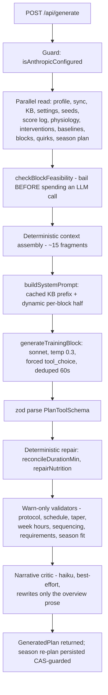

# 06 · Generation — how a training block comes to exist

**Why this exists:** this is where everything upstream converges — the model's insights, the season's focus, the knowledge base, the calibrated parameters — into one prompt, one forced-structure LLM call, and a validation gauntlet. The design bet: deterministic engines decide *what* the block must contain; the LLM only decides *arrangement and wording* ([DECISIONS](../DECISIONS.md) ADR-0002). **Where it sits:** the pipeline's last computational stage; its accepted output becomes calendar events ([01-sync](01-sync-and-data.md)'s mirror) and, once ridden, new input for [02-scoring](02-scoring-and-learning.md). **Tradeoff:** no self-repair loop for structural failures — a malformed response is a visible 502, never a silent patch.

The daily use loop is deliberately minimal — no manual markdown step survives: **sync → generate → review warnings → accept (write) → ride**. Companion docs: [07-ai-layer.md](07-ai-layer.md) (the Anthropic mechanics + all call sites), [05-season.md](05-season.md) (focus selection).

## The two-phase commit

Generation is a **proposal**; nothing becomes real until the athlete accepts.

- `POST /api/generate` — assembles context, calls Claude, validates, returns a `GeneratedPlan`. Persists **nothing** except (best-effort, CAS-guarded) an updated `season-plan.json`.
- `POST /api/write` — the accept step: pushes calendar events to Intervals.icu (idempotent upserts keyed `nodevelo-<date>`, with rollback on partial failure), archives the old block's lived days to `block-history.json`, records interventions, writes `current-block.json`.

A rejected or failed generation therefore never corrupts state or burns calendar writes ([ADR-0003](../DECISIONS.md)).

## Pipeline walkthrough (`app/api/generate/route.ts`, maxDuration 300s)

### 1. Deterministic pre-work (before any AI)

| Step | Module | Output |
|---|---|---|
| Focus selection | `season-signals.gatherFocusInputs` → `season.chooseNextFocus` (or event arc) | The block's `seasonFocus` + season context text |
| Week targets | `block-skeleton.computeWeekTargets` (+ `checkBlockFeasibility` pre-gate) | One **exact** hour figure per week (loading = top of range; recovery = derived retention %) |
| Durability template | `durability.selectDurabilityTemplate` (limiter → goal text → rotation) | Template A–E for the long ride |
| Session requirements | `session-requirements.deriveSessionRequirements` | e.g. "≥1 RaceSim" from goal/terrain text |
| Coaching directives | `athlete-model.deriveInsights` + `intervention.summariseValidation` → `synthesis.synthesizeCoachingDirectives` | ONE ranked, deduped directives block; proven-poor directives (≤34% hit-rate over ≥3 decisive blocks) demoted, never hidden |
| Athlete facts | `coach-snapshot.resolveCoachSignals` / `formatFormFuelLine`, live zones from `physiology.ts`, power profile, quirks, deferred quality, goals/weakpoints (JSON, not the markdown) | Prompt fragments |
| Nutrition table | `nutrition.buildNutritionReferenceRows` | A table the model must **copy from**, never compute |
| Prior-block feedback | `kb-loader.latestRetrospectiveSeeds` + `retrospective-schema.formatReflectionsForPrompt` | The two feedback channels ([04-knowledge.md](04-knowledge.md)) |

### 2. The AI seam

`lib/anthropic-prompts.buildSystemPrompt` splits the system prompt for prompt caching: **cached** = persona + workout-syntax guide + full KB text (stable prefix, `cache_control: ephemeral`); **dynamic** = every per-block fragment above (appended after the breakpoint so it never invalidates the cache). `buildUserMessage` carries the hard rules (interval protocols, RaceSim rules, weekly structure/sequencing) plus the calendar and nutrition table. The call is forced tool-use (`TRAINING_BLOCK_TOOL` from `lib/plan-schema.ts`) — no free-text parsing; the legacy regex parser in `plan-parser.ts` is retired (only its `planDayToEvent` calendar converter is live).

`PlanToolSchema` deliberately declares `weeks` **before** `overview` — tool-use fills fields in declared order, forcing the model to commit every day before summarizing (stops overview/schedule mismatch at the source).

### 3. After the model returns

- **Structural failure = hard throw** (502, manual retry). A truncation is distinguished from malformed output; there is deliberately no auto-repair loop for structure.
- **Deterministic repair (the only mutations)**: `reconcileDurationMin` (stated duration ↔ real step-sum) and `nutrition-validate.repairNutrition` (kcal figure rewritten to the formula's value, with a visible `repairs` note).
- **Warn-only validators** (append to `warnings[]`, never rewrite — [ADR-0004](../DECISIONS.md)): `workout-validate.splitPlanProtocol` (KB-grounded intensity/duration bands; quality-type breaches surface separately as `protocolViolations`), `schedule-validate` (back-to-back hard days, quality budget, event taper, freshness-first sequencing), `block-skeleton.validateWeekHours`, `session-requirements.validateSessionRequirements`, season-fit/focus validators from `season.ts`.
- **Narrative critic** (`lib/narrative-critic.ts`, haiku, forced tool-use): checks the model's written overview against deterministically-extracted real facts of the schedule; may rewrite the **overview only**, never the schedule. Best-effort — a critic failure never blocks the response.

## Provenance & regeneration semantics

Every `GeneratedPlan` is stamped with `model`, `promptVersion` (bump `PROMPT_VERSION` in `anthropic-api.ts` when prompt structure changes), the full raw tool JSON (`raw` — the audit trail), and `durabilityTemplate`/`seasonFocus`. `generate-cache.dedupeGeneration` shares identical in-flight requests and reuses a finished result for **60 seconds only** — generation runs at temperature 0.3 precisely so a considered regenerate minutes later gets real variation. If a "fixed input" seems to change nothing, remember the 60s window.

## Common modifications

| Change | Where | Then |
|---|---|---|
| Prompt rules / wording | `lib/anthropic-prompts.ts` (pure — testable offline) | Bump `PROMPT_VERSION`; update prompt tests; **one live smoke run** (AGENTS.md rule) |
| Block output shape | `lib/plan-schema.ts` (+ `structuredToPlannedDays`) | Keep `weeks` before `overview`; update consumers of `PlannedDay` |
| New validator | `lib/schedule-validate.ts` or `workout-validate.ts`, wired in `app/api/generate/route.ts` | Warn-only unless you have the standing the nutrition repairer has |
| Week-hour logic | `lib/block-skeleton.ts` | Feasibility gate + `validateWeekHours` stay in agreement |
| Protocol bands | ⚠️ Three hand-synced copies: KB prose, `buildUserMessage` hard rules, `workout-validate.PROTOCOL` | Change all three or they drift (see [INVARIANTS](../INVARIANTS.md)) |
