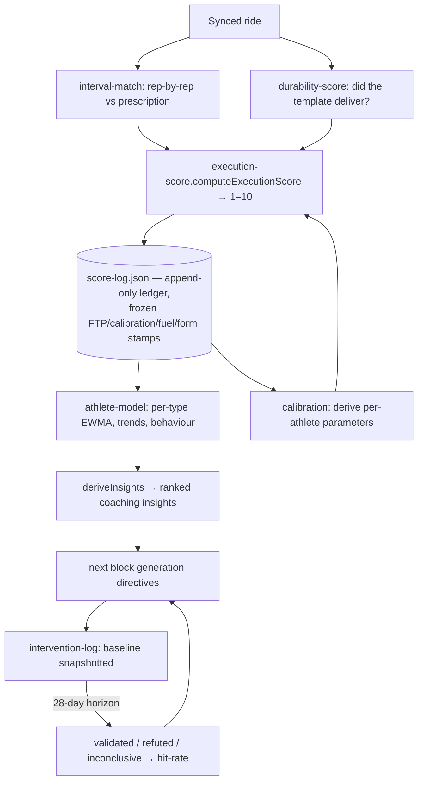

# Scoring & learning loop

How a ride becomes a score, a score becomes a model, and the model changes future coaching. This is the "second brain" — the part that makes NodeVelo a coach rather than a plan printer.

## The scorer (`lib/execution-score.ts`, 368 lines)

`computeExecutionScore` grades **every** ride, planned or off-plan: interval adherence + duration compliance, intensity-vs-type IF bands (per-athlete offsets via calibration), the merged easy-ride HR+efficiency read, durability delivery (±2), off-plan aerobic quality, VI pacing, RPE-vs-intensity. Key exported distinction — three words that are not synonyms:

- **Execution score** — the 1–10 grade.
- **Compliance** — duration completed ÷ prescribed, *capped by execution* (`resolveCompliance`): a sub-5/10 session can never show 100% (the trust guarantee).
- **Adherence** — interval-day rep power vs target (`lib/interval-match.ts`, matched by duration, not power, to resist surge false-matches).

## The ledger (`lib/score-log.ts`, 411 lines)

`buildRideScores` runs the scorer over the sync window and merges into `data/score-log.json` — **append-only**. Past entries are frozen with provenance stamps: FTP-used (`physiologyAsOf`), calibration values, fuel, NP-fallback, form state. Only today's entry keeps re-deriving until the day rolls over. Capped at 400 entries (~6 months). Two named invariants (**LEDGER-1**: a rebuild can never un-plan a frozen entry; **LEDGER-2**: append-only merge) are enforced by `mergeScoreLog` / `mergeScoreLogRebuild` — see [../reference/INVARIANTS.md](../reference/INVARIANTS.md). A one-shot destructive rebuild exists (`/api/sync` POST with `rebuildLedger: true`), guarded by `data/ledger-rebuild.json` (truthy check, not `=== null` — the migration-flag rule).

Dispositions modulate teaching, not scores: a "compromised" ride keeps its raw score but is excluded from teaching the model (`lib/disposition.ts`).

## The model (`lib/athlete-model.ts`)

Rebuilt fresh from the whole ledger on demand: recency-weighted (EWMA, adaptive α from `calibration.autoEwmaAlpha`) per-type execution quality, trend, and behaviour summary → `deriveInsights` ranks coaching insights. Consumed by generation directives, season focus selection, Trends, and athlete state.

## The validation loop (`lib/intervention.ts`)

When an insight actually drives a generated block, `buildInterventions` snapshots a baseline (execution + physiology markers). After a 28-day maturation horizon, `validateInterventions` re-measures: validated / refuted / inconclusive. `summariseValidation` turns the record into a hit-rate that (a) surfaces on Model/Trends as the coach's honesty score and (b) **demotes** directives with a proven-poor hit-rate (≤34% over ≥3 decisive blocks) in `lib/synthesis.ts` — reframed as "try a different lever," evidence never hidden.

## Calibration (`lib/calibration.ts`, 533 lines)

Replaces population magic numbers with athlete-derived values *only when honestly derivable*. The single precedence rule (`trustedCalibration`): **manual override > derived (if discriminating) > population default**. Derived values must separate failures from successes by a margin (`lib/correlation.ts` — `deriveExecutionEdge` finds where things break, `deriveOptimum` where they work); a non-discriminating signal falls back to the default rather than calibrating to habit. Currently calibrated: ACWR bands, TSB deep-fatigue edge, decoupling-good cutoff, carbs optimum, per-type IF-band offsets, durability-insert envelope, athlete-state weights. Import direction is one-way: `calibration → correlation`, never the reverse (cycle avoidance).

## Where each piece runs

Scoring happens inside `POST /api/sync` (see [data-and-sync.md](data-and-sync.md)); the model/insights are computed on demand by `/api/trends`, `/api/generate`, `/api/write`; interventions are recorded at write time and validated at sync time.

## Common modifications

| Change | Where | Watch out |
|---|---|---|
| Scoring signal weights/bands | `execution-score.ts` | Frozen ledger entries must NOT be retro-scored; new logic applies to new entries only |
| New calibratable parameter | `calibration.ts` (+ `correlation.ts` if a new derivation shape) | Route through `trustedCalibration`; keep the discrimination guard |
| New insight type | `athlete-model.deriveInsights` | It only earns prompt space via `synthesis.ts`'s ranking |
| Ledger schema field | `score-log.ts` + `sync-ledger.backfillLedgerEntries` | Backfill must be idempotent; migration flags use truthy checks |
| Test fixtures | — | Don't pin expectations whose pre-rounding value sits on a .x5 float boundary (known IEEE flip trap) |
